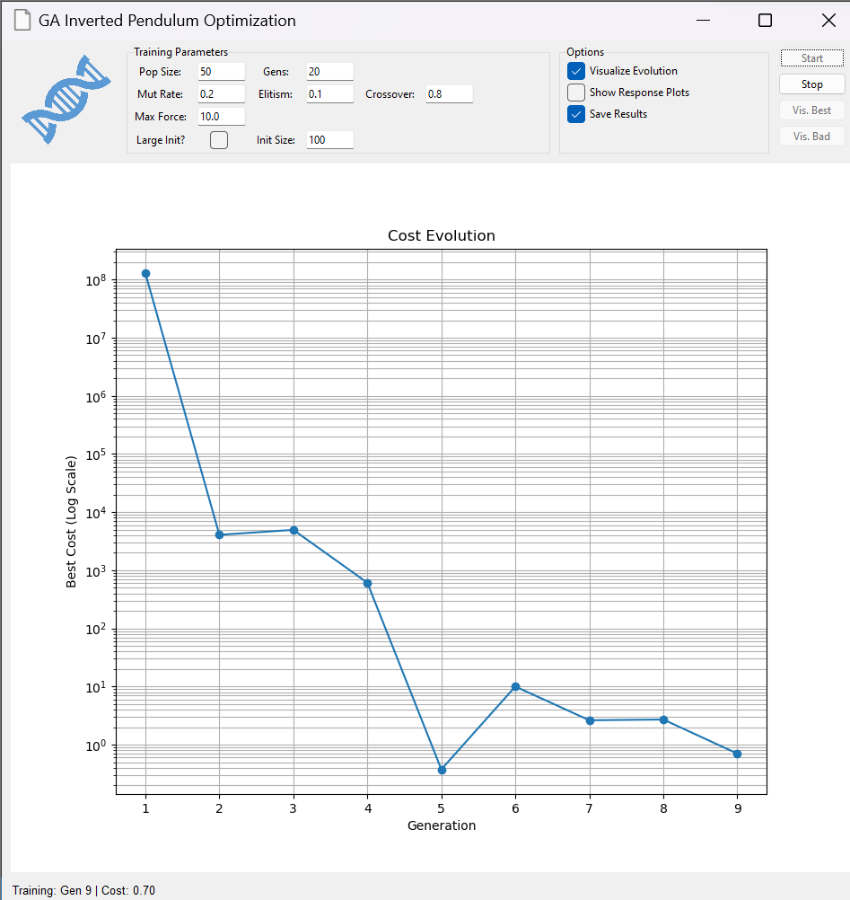
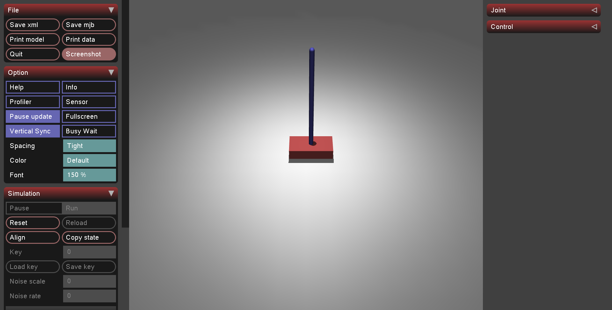

# GA-Optimized Dual PID Controller
### Automated Tuning for Inverted Pendulum using Genetic Algorithms

This repository provides a robust framework for optimizing **Dual PID controllers** to stabilize an inverted pendulum on a cart. It leverages **Genetic Algorithms (GA)** to automatically tune six PID gains (Proportional, Integral, Derivative for both Angle and Position control loops) simultaneously, ensuring optimal stability and minimal control effort. The system is simulated using the high-performance **MuJoCo** physics engine.





## Package Structure

The project is organized into modular components to separate concerns between the GUI, optimization logic, and simulation control.

- **`main.py`**: The entry point of the application. Initializes the GUI.
- **`gui.py`**: Contains the `GA_GUI` class, providing a user-friendly interface to configure and run the genetic algorithm.
- **`optimizer.py`**: Implements the `GeneticAlgorithm` class, handling population initialization, selection, crossover, and mutation.
- **`optimizer_app.py`**: The `OptimizerApp` class bridges the GUI and the Simulation, managing the training loop and evaluating individual controllers.
- **`controller.py`**: Defines the `DualPIDController` class, implementing the control logic for both the Inverted Pendulum angle ($\theta$) and Cart position ($x$).
- **`environment.py`**: Wraps the MuJoCo simulation (`cartpole.xml`), providing a standard interface for resetting and stepping through the environment.
- **`results/`**: Directory where optimization results (population history, best genes) are stored.

## Installation

1.  **Clone the repository**:
    ```bash
    git clone <repository_url>
    cd <repository_name>
    ```

2.  **Install dependencies**:
    Ensure you have Python installed, then install the required packages:
    ```bash
    pip install -r requirements.txt
    ```

## Usage

1.  **Start the Application**:
    Run the main script to launch the GUI.
    ```bash
    python main.py
    ```

2.  **Configure Optimization**:
    Use the GUI to set parameters such as:
    - **Population Size**: Number of controllers in each generation.
    - **Generations**: Total number of evolution cycles.
    - **Elitism Rate**: Percentage of top performers to keep.
    - **Mutation Rate**: Probability of gene mutation.

3.  **Run Training**:
    Click the "Start Optimization" button. The application will simulate generations of controllers. Real-time graphs will show the fitness evolution.

4.  **Visualize Results**:
    Once training is complete, the best performing controller is saved. You can often visualize the best result directly through the app or by loading `best_genes.txt` (depending on specific GUI features).

## Configuration Options

The core Genetic Algorithm and Controller limits are configurable within `optimizer.py` and through the GUI.

Key genes being optimized:
- **Angle Loop**: `Kp_th`, `Ki_th`, `Kd_th` (Controls the pendulum balance)
- **Position Loop**: `Kp_x`, `Ki_x`, `Kd_x` (Keeps the cart near the center)

Search space limits (defined in `optimizer.py`):
- Theta Gains: $K_p \in [-100, 100]$, $K_i, K_d \in [-50, 50]$
- Position Gains: $K_p \in [-50, 50]$, $K_i, K_d \in [-20, 20]$

## Requirements

- Python 3.x
- `mujoco`
- `numpy`
- `matplotlib`
- `tkinter` 

## License

This project is licensed under the MIT License.
